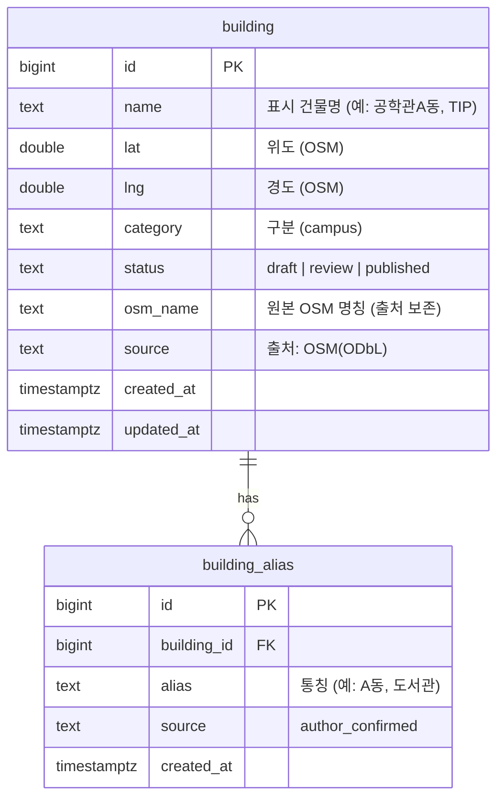
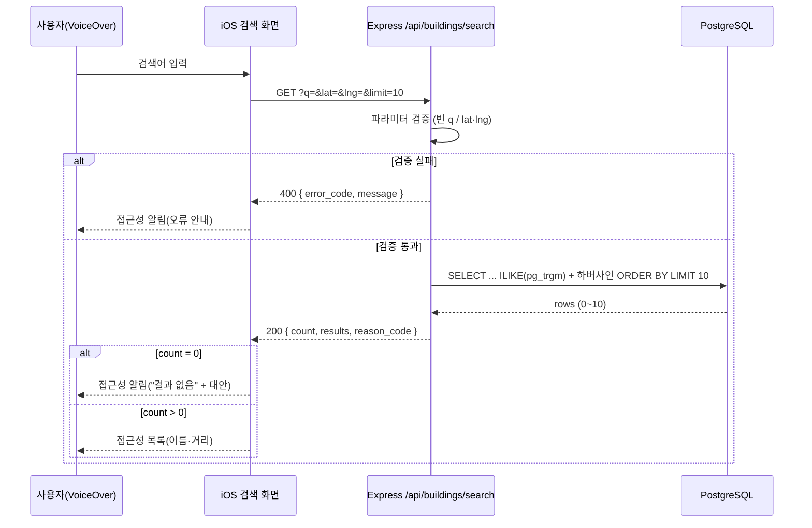

# 슬라이스 #7 상세 설계 — 건물 검색 API

2단계 산출물. 결정 근거는 [ADR-007](../adr/ADR-007-search-implementation.md), 시드 원본·출처는 [seed-buildings.md](seed-buildings.md), 대안·기각은 [01-design-notes.md](01-design-notes.md) 참조.

범위(정정): #7 AC는 "질의 매칭(부분일치 ∪ 별칭) → 게시 건물만 → 현재 위치 기준 **거리순 최대 10건** → 0건이면 사유 코드"다. 반경 밴드(50/100/150m)·"외 N개"는 #7에 없다 — 브리핑 엔진 E2의 동작이며 E2는 이번 슬라이스 제외.

## ERD



- `status`: `CHECK (status IN ('draft','review','published'))`, 기본값 `draft`. 시드는 전부 `published`. 게시 상태 **전이 이력 테이블은 제외**(검수·게시는 관리자 웹 #11, 범위 밖). R-12b(게시 건물만 노출)는 검색 쿼리의 `WHERE status='published'`로 강제.
- `building_alias`: `UNIQUE(building_id, alias)`. 출처는 전부 `author_confirmed`(저자 확인). OSM엔 통칭이 없어 별칭은 저자가 확인한 값이다.
- 브리핑 문안 컬럼: **제외**(브리핑 범위 밖).
- 인덱스: `building.name`·`building_alias.alias`에 `gin_trgm_ops` GIN 인덱스, `building.status`에 btree, `building_alias.building_id`에 btree.

## 검색 쿼리 (개념)

```sql
-- :q = 질의, :lat/:lng = 현재 위치, LIMIT 10
SELECT b.id, b.name,
       6371000 * 2 * asin(sqrt(
         power(sin(radians(b.lat - :lat)/2), 2) +
         cos(radians(:lat)) * cos(radians(b.lat)) *
         power(sin(radians(b.lng - :lng)/2), 2)
       )) AS distance_m
FROM building b
WHERE b.status = 'published'
  AND (
        b.name ILIKE '%'||:q||'%'
        OR EXISTS (SELECT 1 FROM building_alias a
                   WHERE a.building_id = b.id
                     AND a.alias ILIKE '%'||:q||'%')
      )
ORDER BY distance_m ASC
LIMIT 10;
```

`matched_alias`(어떤 별칭으로 걸렸는지)는 별도 LATERAL 조인으로 채운다 — 상세는 3·5단계에서.

## 검색 API — OpenAPI

```yaml
openapi: 3.1.0
info:
  title: InnerMap 건물 검색 API
  version: 0.1.0
paths:
  /api/buildings/search:
    get:
      summary: 게시 건물을 부분일치·별칭으로 찾아 거리순 최대 10건 반환
      parameters:
        - { name: q,   in: query, required: true,  schema: { type: string, minLength: 1 },
            description: "검색어. 공백만/빈 문자열은 400. 1자 허용." }
        - { name: lat, in: query, required: true,  schema: { type: number, minimum: -90,  maximum: 90 } }
        - { name: lng, in: query, required: true,  schema: { type: number, minimum: -180, maximum: 180 } }
        - { name: limit, in: query, required: false, schema: { type: integer, minimum: 1, maximum: 10, default: 10 } }
      responses:
        '200':
          description: 검색 결과 (0건 포함)
          content:
            application/json:
              schema: { $ref: '#/components/schemas/SearchResult' }
        '400':
          description: 잘못된 파라미터
          content:
            application/json:
              schema: { $ref: '#/components/schemas/Error' }
components:
  schemas:
    SearchResult:
      type: object
      required: [count, results]
      properties:
        count:   { type: integer, description: "results 길이 (0~10)" }
        results:
          type: array
          items: { $ref: '#/components/schemas/SearchItem' }
        reason_code:
          type: [string, 'null']
          enum: [NO_MATCH, null]
          description: "count=0일 때만 채움. 매칭 없음=NO_MATCH."
    SearchItem:
      type: object
      required: [id, name, distance_m]
      properties:
        id:            { type: integer }
        name:          { type: string }
        matched_alias: { type: [string, 'null'], description: "별칭으로 걸렸으면 그 별칭, 이름으로 걸렸으면 null" }
        distance_m:    { type: number, description: "현재 위치로부터 미터(하버사인)" }
    Error:
      type: object
      required: [error_code, message]
      properties:
        error_code: { type: string, enum: [EMPTY_QUERY, INVALID_LOCATION, INVALID_PARAM] }
        message:    { type: string }
```

오류 규칙: 빈/공백 `q` → 400 `EMPTY_QUERY` · `lat`/`lng` 누락·범위 밖·비수치 → 400 `INVALID_LOCATION` · 그 밖 잘못된 파라미터(`limit` 비정수 등) → 400 `INVALID_PARAM`. `limit`은 10 초과 시 10으로 절삭(AC "최대 10건").

## 시퀀스 (앱 → 서버 → DB)



## 출처·라이선스 (파생 시드에 반드시 유지)

시드는 OpenStreetMap 파생 데이터다. 파생 시드 파일과 교재 지면에 **"© OpenStreetMap contributors" (ODbL)** 출처를 유지한다. 운영 데이터는 ADR-003대로 공공데이터(수집 배치 #10)에서 오며, 이 개발 시드와 출처가 다름을 교재에 밝힌다.
